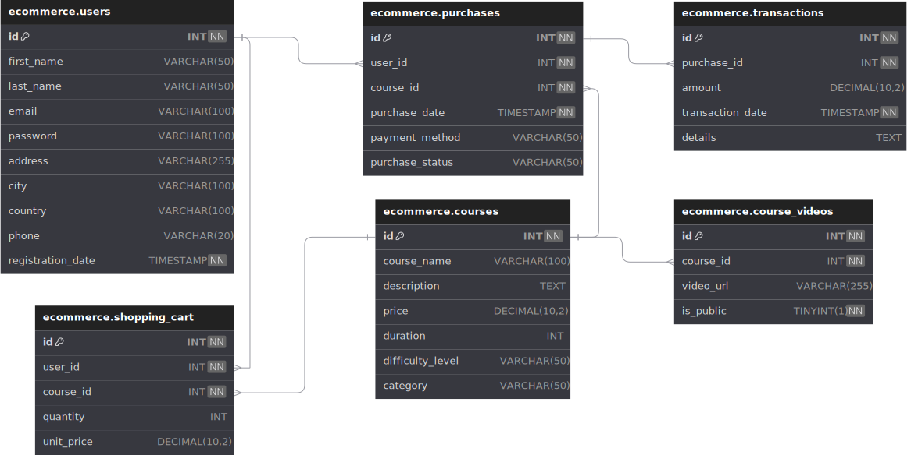

# Ecommerce Project with Django, MySQL, and React

This project is a full-stack ecommerce solution built using Django for the backend, MySQL for the database, and React for the frontend. It provides a robust and scalable platform for managing products, processing transactions, and delivering a modern user experience.

## Database Schema

Below is the SQL script for creating the database tables:

```sql
-- MySQL Workbench Forward Engineering

SET @OLD_UNIQUE_CHECKS=@@UNIQUE_CHECKS, UNIQUE_CHECKS=0;
SET @OLD_FOREIGN_KEY_CHECKS=@@FOREIGN_KEY_CHECKS, FOREIGN_KEY_CHECKS=0;
SET @OLD_SQL_MODE=@@SQL_MODE, SQL_MODE='TRADITIONAL,ALLOW_INVALID_DATES';

-- Schema ecommerce
CREATE SCHEMA IF NOT EXISTS `ecommerce` DEFAULT CHARACTER SET utf8mb4 COLLATE utf8mb4_0900_ai_ci ;
USE `ecommerce` ;

-- Table `ecommerce`.`users`
CREATE TABLE IF NOT EXISTS `ecommerce`.`users` (
  `id` INT NOT NULL AUTO_INCREMENT,
  `first_name` VARCHAR(50) NULL,
  `last_name` VARCHAR(50) NULL,
  `email` VARCHAR(100) NULL,
  `password` VARCHAR(100) NULL,
  `address` VARCHAR(255) NULL,
  `city` VARCHAR(100) NULL,
  `country` VARCHAR(100) NULL,
  `phone` VARCHAR(20) NULL,
  `registration_date` TIMESTAMP NOT NULL DEFAULT CURRENT_TIMESTAMP,
  PRIMARY KEY (`id`))
ENGINE = InnoDB;

-- Table `ecommerce`.`courses`
CREATE TABLE IF NOT EXISTS `ecommerce`.`courses` (
  `id` INT NOT NULL AUTO_INCREMENT,
  `course_name` VARCHAR(100) NULL,
  `description` TEXT NULL,
  `price` DECIMAL(10, 2) NULL,
  `duration` INT NULL,
  `difficulty_level` VARCHAR(50) NULL,
  `category` VARCHAR(50) NULL,
  PRIMARY KEY (`id`))
ENGINE = InnoDB;

-- Table `ecommerce`.`purchases`
CREATE TABLE IF NOT EXISTS `ecommerce`.`purchases` (
  `id` INT NOT NULL AUTO_INCREMENT,
  `user_id` INT NOT NULL,
  `course_id` INT NOT NULL,
  `purchase_date` TIMESTAMP NOT NULL DEFAULT CURRENT_TIMESTAMP,
  `payment_method` VARCHAR(50) NULL,
  `purchase_status` VARCHAR(50) NULL,
  PRIMARY KEY (`id`),
  INDEX `fk_purchases_users_idx` (`user_id` ASC) VISIBLE,
  INDEX `fk_purchases_courses_idx` (`course_id` ASC) VISIBLE,
  CONSTRAINT `fk_purchases_users`
    FOREIGN KEY (`user_id`)
    REFERENCES `ecommerce`.`users` (`id`)
    ON DELETE NO ACTION
    ON UPDATE NO ACTION,
  CONSTRAINT `fk_purchases_courses`
    FOREIGN KEY (`course_id`)
    REFERENCES `ecommerce`.`courses` (`id`)
    ON DELETE NO ACTION
    ON UPDATE NO ACTION)
ENGINE = InnoDB;

-- Table `ecommerce`.`transactions`
CREATE TABLE IF NOT EXISTS `ecommerce`.`transactions` (
  `id` INT NOT NULL AUTO_INCREMENT,
  `purchase_id` INT NOT NULL,
  `amount` DECIMAL(10, 2) NULL,
  `transaction_date` TIMESTAMP NOT NULL DEFAULT CURRENT_TIMESTAMP,
  `details` TEXT NULL,
  PRIMARY KEY (`id`),
  INDEX `fk_transactions_purchases_idx` (`purchase_id` ASC) VISIBLE,
  CONSTRAINT `fk_transactions_purchases`
    FOREIGN KEY (`purchase_id`)
    REFERENCES `ecommerce`.`purchases` (`id`)
    ON DELETE NO ACTION
    ON UPDATE NO ACTION)
ENGINE = InnoDB;

-- Table `ecommerce`.`shopping_cart`
CREATE TABLE IF NOT EXISTS `ecommerce`.`shopping_cart` (
  `id` INT NOT NULL AUTO_INCREMENT,
  `user_id` INT NOT NULL,
  `course_id` INT NOT NULL,
  `quantity` INT NULL,
  `unit_price` DECIMAL(10, 2) NULL,
  PRIMARY KEY (`id`),
  INDEX `fk_shopping_cart_users_idx` (`user_id` ASC) VISIBLE,
  INDEX `fk_shopping_cart_courses_idx` (`course_id` ASC) VISIBLE,
  CONSTRAINT `fk_shopping_cart_users`
    FOREIGN KEY (`user_id`)
    REFERENCES `ecommerce`.`users` (`id`)
    ON DELETE NO ACTION
    ON UPDATE NO ACTION,
  CONSTRAINT `fk_shopping_cart_courses`
    FOREIGN KEY (`course_id`)
    REFERENCES `ecommerce`.`courses` (`id`)
    ON DELETE NO ACTION
    ON UPDATE NO ACTION)
ENGINE = InnoDB;

-- Table `ecommerce`.`course_videos`
CREATE TABLE IF NOT EXISTS `ecommerce`.`course_videos` (
  `id` INT NOT NULL AUTO_INCREMENT,
  `course_id` INT NOT NULL,
  `video_url` VARCHAR(255) NULL,
  `is_public` TINYINT(1) NOT NULL DEFAULT 0,
  PRIMARY KEY (`id`),
  INDEX `fk_course_videos_courses_idx` (`course_id` ASC) VISIBLE,
  CONSTRAINT `fk_course_videos_courses`
    FOREIGN KEY (`course_id`)
    REFERENCES `ecommerce`.`courses` (`id`)
    ON DELETE NO ACTION
    ON UPDATE NO ACTION)
ENGINE = InnoDB;
```
##
# Database Example Entity-Relationship Diagram

